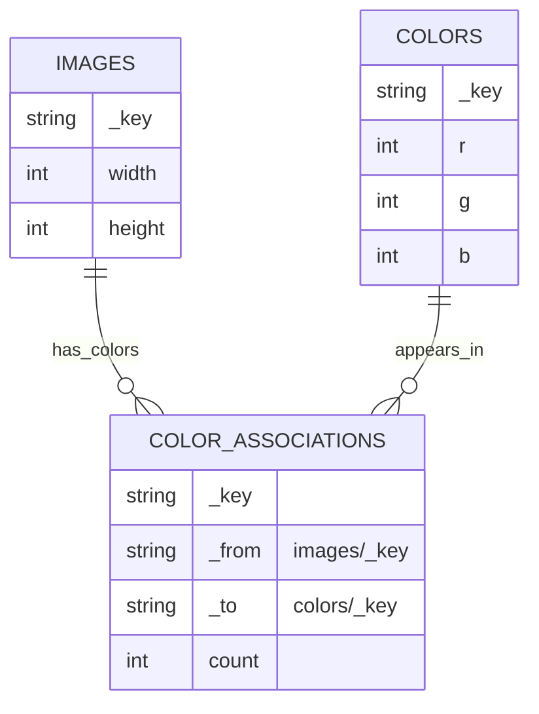

# Data model understanding + ERD

This project models scanned manuscript pages and their pixel colors in ArangoDB.

At a high level:

- **`images`**: a document collection of page scans (one document per page/image).
- **`colors`**: a document collection of distinct pixel colors (one document per unique RGB triple).
- **`colorAssociations`**: an **edge collection** that connects an image to a color, carrying rollups like **how many pixels of that color occur on that page**.

Concretely, the database stores *aggregated* per-page color counts: an edge per `(image, color)` pair with a `count`.

## Entities

### `images` (document collection)

Represents a single scanned page.

Fields present in `images` documents:

- **`_key`**: page identifier.
- **`width`**, **`height`**: pixel dimensions of the processed/cropped image.

### `colors` (document collection)

Represents a single distinct color value.

Fields present in `colors` documents:

- **`_key`**: canonical color id in the format `RGB(r,g,b)` (for example: `RGB(148,138,124)`).
- **`r`**, **`g`**, **`b`**: 8-bit channel values.

### `colorAssociations` (edge collection)

Represents the association “this page contains this color” with aggregate measures.

Fields present in `colorAssociations` edges:

- **`_from`**: reference to an `images/<_key>` document.
- **`_to`**: reference to a `colors/<_key>` document.
- **`count`**: number of pixels in the image with that exact color.

Notes:

- This edge collection is effectively a **many-to-many** join between `images` and `colors` with payload (`count`).
- Your query groups by `_to` across the whole corpus to compute “global color popularity”.
- Indexing `colorAssociations._to` (and often compound indexing on `(_from, _to)`) is important for performance at scale.

## ERD (Mermaid)

## Relationship semantics

- **Per page palette**: all outgoing edges from an `images` document give you that page’s palette (with frequency).
- **Global palette**: grouping edges by `_to` across all `images` gives you the manuscript-wide color distribution.
- **Most “colorful” pages**: sum `count` by `_from` (or compute number of distinct colors per page by counting edges).

## What is *not* represented directly (by design)

This model does **not** store each pixel’s \(x, y\) coordinate as separate records in ArangoDB.

If you ever need exact pixel positions, the typical scalable approach is:

- keep ArangoDB as the **index/aggregate** layer (like it is now), and
- store per-pixel or per-tile raster data in a dedicated format (chunked binary / parquet / zarr), referenced from `images` or from additional “tile” documents.

